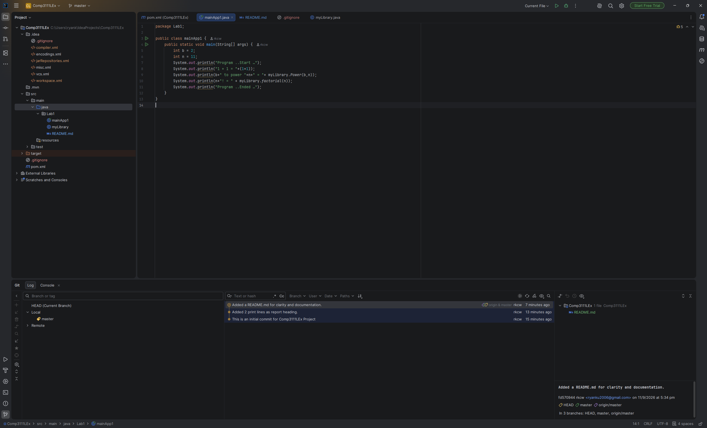

# COMP3111 Lab Exercise 1

This folder contains the lab 1 exercise for the course COMP3111.

Includes:
- 2 simple mathematical functions in myLibrary.
- a simple output report testing said functions.

